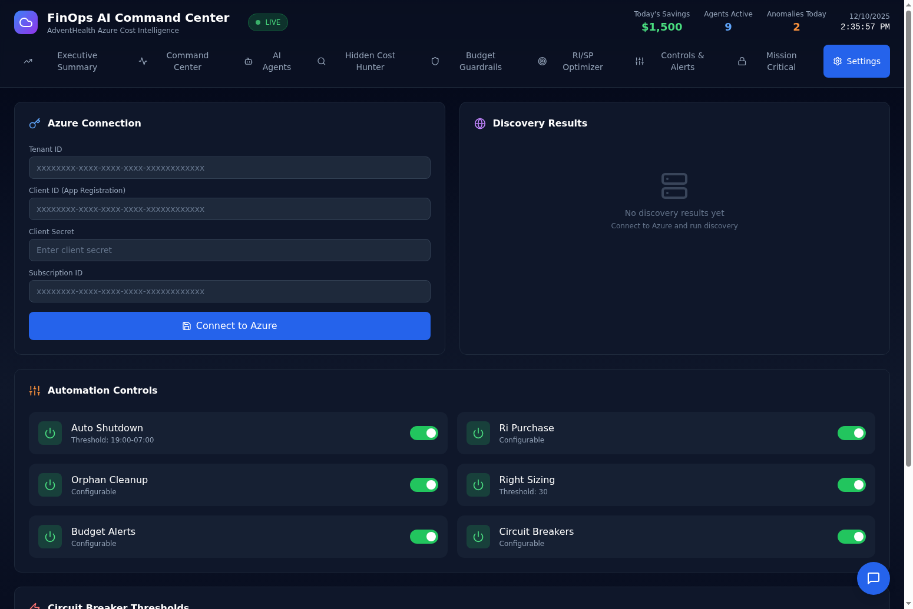
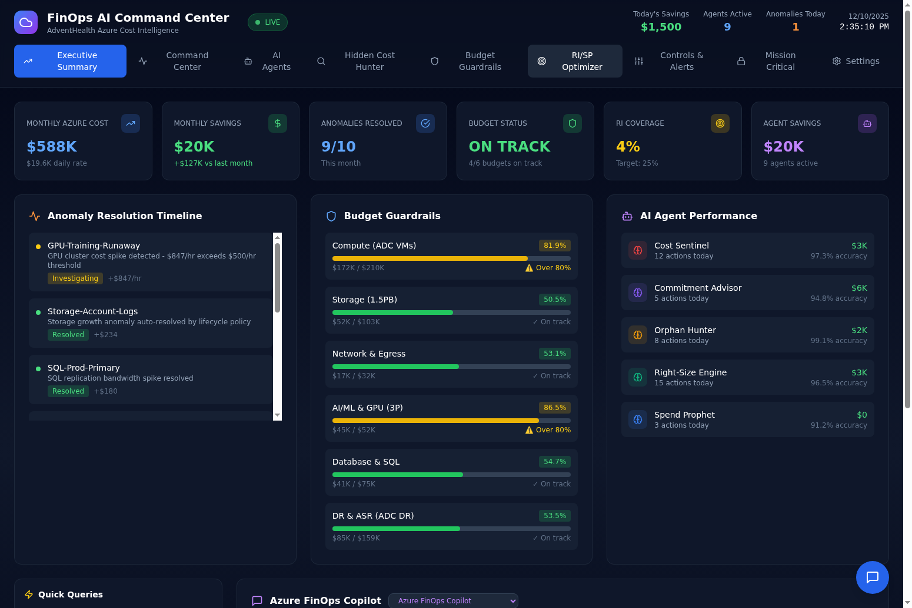
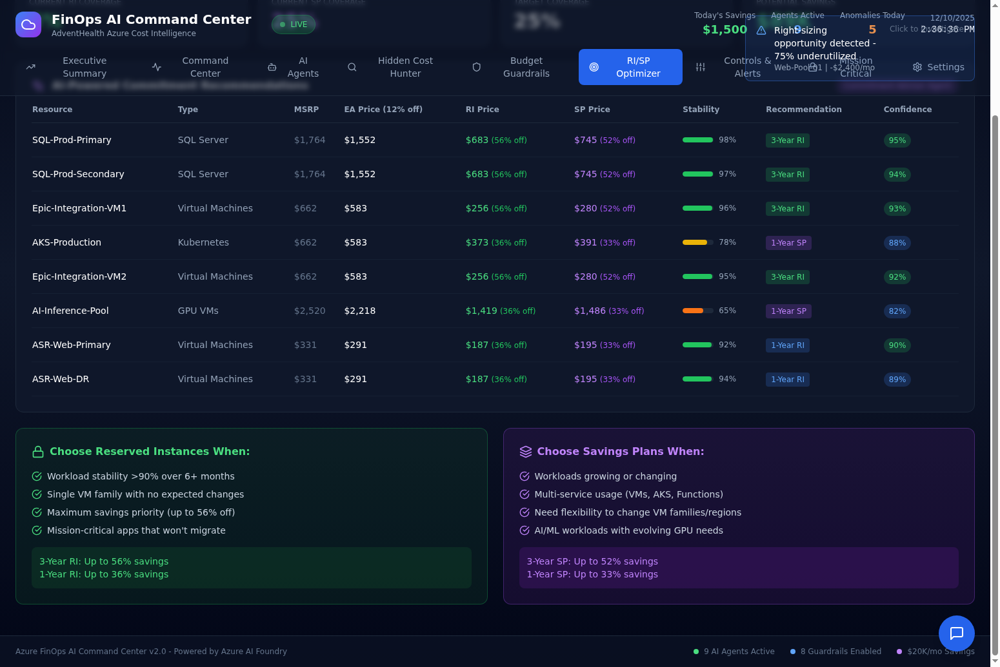
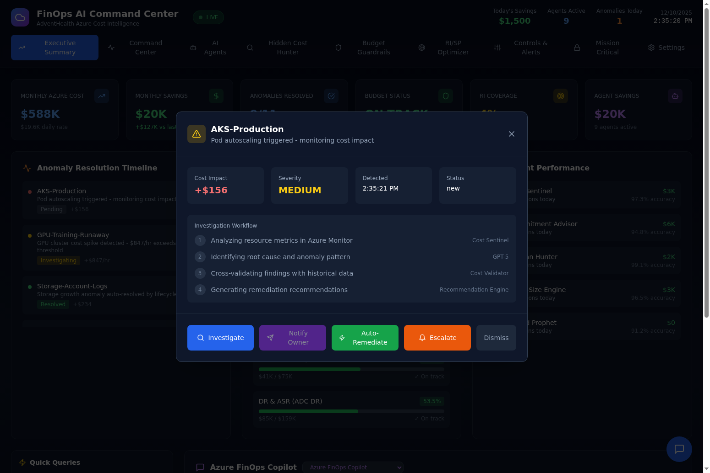

# FinOps AI Command Center

A comprehensive Azure FinOps dashboard for cost optimization, anomaly detection, and intelligent resource management.

## Connect Your Azure Tenant

The dashboard connects to your Azure subscription to pull real cost data, recommendations, and budget information. Without Azure credentials, the dashboard runs in demo mode with simulated data.



### Prerequisites

Before connecting, you need an Azure App Registration with the following permissions:

- **Cost Management Reader** - Read cost and usage data
- **Reader** - Read resource information  
- **Advisor Recommendations Reader** (optional) - Read Azure Advisor recommendations

### Step 1: Create App Registration

1. Go to Azure Portal > Azure Active Directory > App registrations
2. Click "New registration"
3. Name it "FinOps Dashboard" and register
4. Note the **Application (client) ID** and **Directory (tenant) ID**
5. Go to "Certificates & secrets" > "New client secret"
6. Note the **Client Secret value** (copy immediately, it won't show again)

### Step 2: Assign Permissions

1. Go to your Subscription > Access control (IAM)
2. Click "Add role assignment"
3. Assign "Cost Management Reader" role to your App Registration
4. Repeat for "Reader" role

### Step 3: Connect in Dashboard

1. Open the dashboard and go to **Settings** tab
2. Enter your credentials:
   - **Tenant ID**: Your Azure AD tenant ID
   - **Client ID**: App registration client ID
   - **Client Secret**: The secret you created
   - **Subscription ID**: Your Azure subscription ID
3. Click "Connect to Azure"

Once connected, the dashboard badge changes from "DEMO DATA" to "LIVE DATA" and all cost information comes directly from Azure Cost Management APIs.

### Conditional Access Exception Process

If your organization uses Azure AD Conditional Access policies, the FinOps Dashboard service principal may be blocked from accessing Azure APIs. You'll see authentication errors like "AADSTS53003: Access has been blocked by Conditional Access policies."

**To request an exception:**

1. **Identify the blocking policy**: Check Azure AD Sign-in logs for the service principal to identify which Conditional Access policy is blocking access.

2. **Submit exception request**: Contact your Azure AD administrator or security team with:
   - Service Principal Name: "FinOps Dashboard"
   - Application (Client) ID: Your app registration client ID
   - Business justification: "Automated cost management and RI/SP optimization for FinOps governance"
   - Required APIs: Azure Cost Management, Azure Advisor, Azure Consumption
   - Access pattern: Server-to-server (no user interaction)

3. **Recommended exception approach**:
   - Create a named location for the FinOps backend server IP
   - Exclude the FinOps service principal from MFA requirements (it uses client credentials, not user auth)
   - Or create a dedicated Conditional Access policy that allows the service principal with appropriate controls

4. **Alternative: Use Managed Identity**: If running in Azure (e.g., Azure Container Apps, AKS), use a Managed Identity instead of service principal credentials. Managed Identities are often exempt from Conditional Access policies.

5. **Offline Mode**: While waiting for the exception, use the dashboard's offline import feature to manually upload Azure Advisor exports and still get AI-powered recommendations.

---

## What's Working Now

These features are fully implemented and tested:

### Core Dashboard (Demo Mode)



The dashboard includes 9 tabs with full functionality in demo mode:

- **Executive Summary** - Cost metrics, anomaly timeline, budget guardrails, AI agent performance, conversational AI chat
- **Command Center** - Real-time anomaly detection, variance analysis, 6-month forecast
- **AI Agents** - 9 specialized agents with accuracy scores and actions taken
- **Hidden Cost Hunter** - Identifies orphaned resources, idle VMs, unattached disks
- **Budget Guardrails** - Configurable thresholds (60% info, 80% warning, 90% critical)
- **RI/SP Optimizer** - Commitment recommendations with pricing breakdown
- **Controls & Alerts** - Alert configuration and notification settings
- **Mission Critical** - Healthcare workload monitoring (Epic, SQL Always On, ASR)
- **Settings** - Azure connection, automation controls, circuit breakers

### Phase 1: Azure Data Integration

When Azure credentials are configured, the dashboard pulls real data:

| Endpoint | Description |
|----------|-------------|
| `/api/azure/health` | Connection status check |
| `/api/azure/costs/daily` | Daily cost breakdown from Azure Cost Management |
| `/api/azure/costs/by-service` | Cost breakdown by Azure service |
| `/api/azure/costs/summary` | Cost summary with totals |
| `/api/azure/recommendations` | Real recommendations from Azure Advisor |
| `/api/azure/recommendations/savings` | Potential savings from recommendations |

The frontend shows a "LIVE DATA" badge when connected to Azure, or "DEMO DATA" when running with simulated data.

### Phase 2: Background Scheduler & Historical Tracking

Automatic data refresh and historical tracking:

- **APScheduler** with 4 background jobs:
  - Hourly cost data refresh
  - 6-hourly recommendation refresh
  - Hourly budget status refresh
  - Hourly anomaly detection (flags spikes >25% above 30-day baseline)
- **SQLAlchemy models** for historical data persistence
- **Azure Budgets API** integration for real budget alerts

New endpoints:

| Endpoint | Description |
|----------|-------------|
| `/api/history/daily-costs` | Historical daily costs from database |
| `/api/history/cost-trend` | Weekly cost trends with WoW comparison |
| `/api/anomalies` | Detected anomalies with status filtering |
| `/api/azure/budgets` | Budget summary from Azure Consumption API |
| `/api/scheduler/status` | Background job status and next run times |

Frontend updates:
- Anomaly alert banner in Command Center when open anomalies detected
- Scheduler status display in Settings tab showing job status

### RI/SP Optimizer



AI-powered commitment recommendations with full pricing breakdown:

- **MSRP** - Azure retail price
- **EA Price** - MSRP minus enterprise discount (e.g., 12%)
- **RI/SP Prices** - Additional discounts:
  - 1-Year RI: 36% off EA price
  - 3-Year RI: 56% off EA price
  - 1-Year SP: 33% off EA price
  - 3-Year SP: 52% off EA price

Decision rubric helps choose between Reserved Instances (stable workloads, maximum savings) and Savings Plans (flexible workloads, multi-service usage).

### Alert Investigation Workflow



Click any alert to open the investigation modal:
- 4-step AI-powered investigation workflow
- Contextual recommendations based on alert type
- Email notification to resource owner (simulated)
- Action buttons: Investigate, Notify Owner, Auto-Remediate, Escalate, Dismiss

---

### Phase 3: Workload Intelligence Layer

The Workload Intelligence Layer adds business context awareness to RI/SP commitment decisions:

**Workload Registry** - Register business applications with their Azure resource mappings:
- Resource group patterns for automatic matching
- Workload lifecycle status (active, evaluating, migrating, sunset)
- Maximum commitment term constraints
- Owner information for notifications

**Technology Evaluations** - Track SaaS/vendor evaluations that might replace Azure workloads:
- POC success scores and adoption probability
- Executive sponsorship tracking
- Decision dates and hold expiration
- Affected Azure services and spend

**SaaS Evaluator AI Agent** - Analyzes technology evaluations for commitment risk:
- Risk score (0-10) based on POC results, executive support, pricing, migration complexity
- Confidence scoring with reasoning
- Recommended actions: approve, modify, hold, block
- Microsoft Agent Lightning integration for RL-based continuous improvement

**Document Service** - Upload and analyze supporting documents:
- Supports .docx, .pdf, .xlsx, .txt, .csv files
- Automatic text extraction for AI analysis
- Links documents to workloads or evaluations

**Smart Recommendations** - Enriched Azure recommendations with intelligence:
- Automatic workload matching via resource group patterns
- Blocking evaluation detection
- Priority-based action determination
- Manual override support with expiration

New Phase 3 endpoints:

| Endpoint | Description |
|----------|-------------|
| `/api/recommendations/smart` | Recommendations with workload intelligence |
| `/api/recommendations/{id}/details` | Full details for drawer UI |
| `/api/workloads` | List/create workloads |
| `/api/evaluations` | List/create technology evaluations |
| `/api/evaluations/{id}/analyze` | Run SaaS evaluator AI agent |
| `/api/evaluations/{id}/documents` | Upload evaluation documents |
| `/api/workloads/{id}/documents` | Upload workload documents |
| `/api/recommendations/{id}/override` | Set manual override |
| `/api/intelligence/status` | Intelligence layer status |

---

## Future Updates (Not Yet Implemented)

These features are planned for future phases:

### Phase 4: Enterprise Features
- Multi-subscription support
- Role-based access control (RBAC)
- Azure SQL database migration (from SQLite)
- Custom report builder
- Slack/Teams integration for alerts
- Deep-dive drawer UI for recommendation details

---

## Quick Start

### Backend Setup

```bash
cd finops-backend
poetry install
cp .env.example .env
# Edit .env with your Azure OpenAI credentials
poetry run uvicorn app.main:app --reload --port 8000
```

### Frontend Setup

```bash
cd finops-frontend
npm install
npm run dev
```

The frontend runs at http://localhost:5173 and connects to the backend at http://localhost:8000.

### Environment Variables

Create `.env` in the backend directory:

```env
# Azure OpenAI (required for chat)
AZURE_OPENAI_ENDPOINT=https://your-resource.openai.azure.com/
AZURE_OPENAI_API_KEY=your-api-key
AZURE_OPENAI_DEPLOYMENT=gpt-4

# Azure Service Principal (optional - for live data)
AZURE_TENANT_ID=your-tenant-id
AZURE_CLIENT_ID=your-client-id
AZURE_CLIENT_SECRET=your-client-secret
AZURE_SUBSCRIPTION_ID=your-subscription-id
```

---

## Architecture

### Backend (FastAPI + SQLite)
- Python 3.11 with FastAPI
- SQLite for data persistence
- APScheduler for background jobs
- SQLAlchemy ORM for historical data
- Azure SDK for Cost Management, Advisor, and Consumption APIs

### Frontend (React + TypeScript)
- React 18 with TypeScript
- Tailwind CSS for styling
- Recharts for data visualization
- Sonner for toast notifications

### AI Integration
- Azure OpenAI GPT-5 for conversational queries
- Data-aware responses querying real database
- Rich text formatting for clean display

---

## Demo Video

Watch the narrated demo showcasing the dashboard features:

[](https://github.com/gregnatkatz/finops/raw/mainbr/video_assets/finops_demo.mp4)

**[Download Demo Video (6.8 MB)](https://github.com/gregnatkatz/finops/raw/mainbr/video_assets/finops_demo.mp4)**

---

## Technology Stack

- **Frontend**: React 18, TypeScript, Tailwind CSS, Recharts, Sonner
- **Backend**: FastAPI, SQLite, SQLAlchemy, APScheduler, Python 3.11
- **AI**: Azure OpenAI GPT-5
- **Azure SDKs**: azure-mgmt-costmanagement, azure-mgmt-advisor, azure-mgmt-consumption
- **Deployment**: Fly.io (backend), Static hosting (frontend)

## License

MIT License
