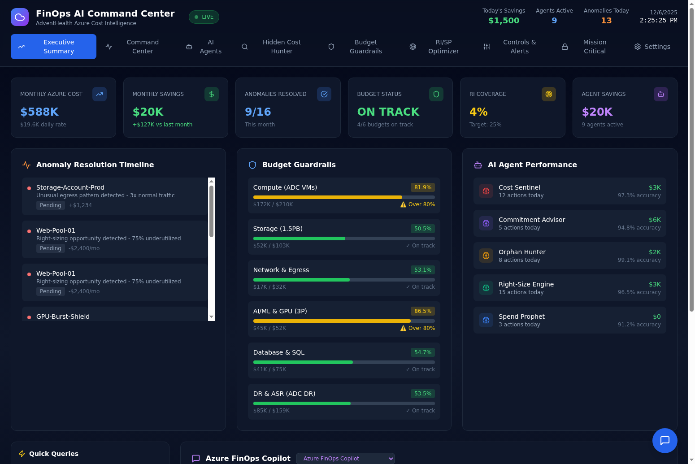
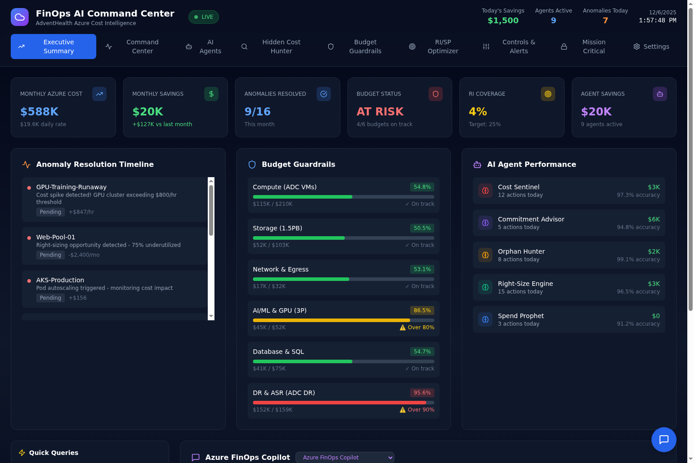
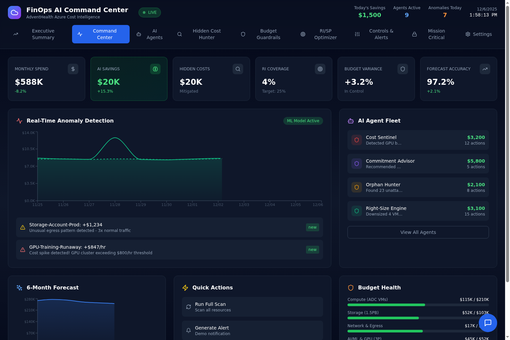
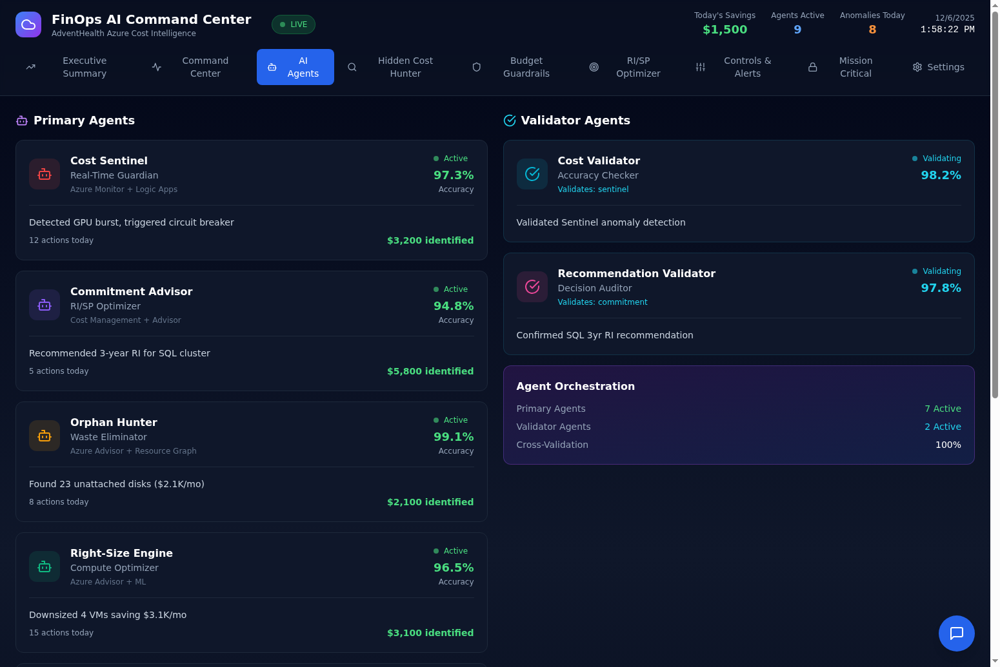
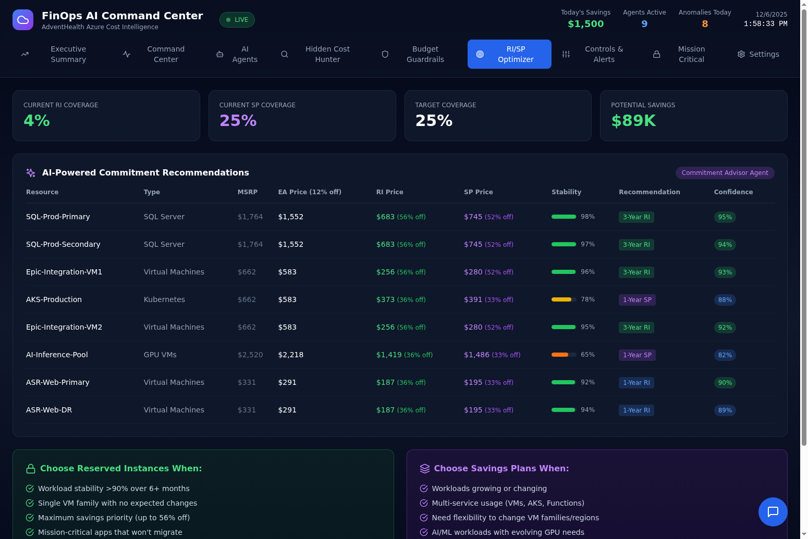

# FinOps AI Command Center

A comprehensive Azure FinOps dashboard for cost optimization, anomaly detection, and intelligent resource management. Built for AdventHealth Azure Cost Intelligence.

## Demo Video

Watch the 5-minute narrated demo showcasing cost spike detection, AI agent orchestration, and RI/SP optimization:

[](https://github.com/gregnatkatz/finops/raw/mainbr/video_assets/finops_demo.mp4)

**[Download Demo Video (6.8 MB)](https://github.com/gregnatkatz/finops/raw/mainbr/video_assets/finops_demo.mp4)** | Voice narration generated with Azure OpenAI Realtime Mini

The demo covers:
- Executive Summary with real AdventHealth cost data
- Real-time anomaly detection (GPU cost spike at $847/hr)
- AI Agent Fleet with 9 agents and cross-validation
- RI/SP Optimizer with pricing breakdown (MSRP → EA → RI/SP)
- Budget Guardrails with threshold alerts
- Automation Controls and alert configuration

---



## Overview

The FinOps AI Command Center is a real-time cost management platform that combines AI-powered agents with Azure-native controls to provide complete visibility into cloud spending, detect anomalies, and optimize resource commitments.

### Key Features

**Real-Time Cost Monitoring**
- Live dashboard with $588K monthly Azure cost tracking
- $19.6K daily rate monitoring based on actual AdventHealth MBR data
- Real-time anomaly detection with ML-powered baseline comparisons
- Automatic alerts for cost spikes exceeding thresholds

**AI Agent Fleet**
- 9 specialized AI agents working in orchestration
- Primary agents: Cost Sentinel, Commitment Advisor, Orphan Hunter, Right-Size Engine, Spend Prophet, Storage Optimizer, GPT-5
- Validator agents: Cost Validator, Recommendation Validator
- Cross-validation ensures 97%+ accuracy on recommendations

**Budget Guardrails**
- Configurable threshold alerts (60% info, 80% warning, 90% critical)
- 6 budget categories: Compute, Storage, Network, AI/ML, Database, DR
- Visual indicators showing 4 healthy, 1 warning, 1 critical status

**RI/SP Optimizer**
- Current RI coverage: 4% with target of 25%
- AI-powered commitment recommendations with confidence scores
- Pricing breakdown: MSRP, EA Price (12% AdventHealth discount), RI/SP prices
- Decision rubric for choosing between Reserved Instances and Savings Plans

## Screenshots

### Command Center
Real-time anomaly detection with ML model, AI agent fleet status, 6-month forecast, and budget health overview.



### AI Agents
View all 9 AI agents with their accuracy scores, actions taken, and savings identified. Includes validator agents for cross-validation.



### RI/SP Optimizer
AI-powered commitment recommendations showing MSRP, EA pricing with 12% discount, and RI/SP prices with stability scores.



## Architecture

### Backend (FastAPI + SQLite)
- RESTful API with 20+ endpoints
- SQLite database for persistent storage
- GPT-5 integration via Azure OpenAI for conversational AI
- Historical anomaly data with root causes and resolutions

### Frontend (React + Tailwind CSS)
- Dark blue theme with real-time updates
- 9 tabs: Executive Summary, Command Center, AI Agents, Hidden Cost Hunter, Budget Guardrails, RI/SP Optimizer, Controls & Alerts, Mission Critical, Settings
- Sonner toast notifications for alerts
- Investigation workflow modals with email notifications

### AI Integration
- Azure OpenAI GPT-5 for conversational queries
- Data-aware responses that query real database tables
- Keyword matching for anomalies, budgets, savings, RI coverage
- Rich text formatting (no markdown) for clean display

## Data Sources

Based on real AdventHealth December 2025 MBR data:

| Metric | Value |
|--------|-------|
| Total ACR | $2.83M |
| Daily Rate | $19.6K (+22% YoY) |
| Monthly Azure Cost | $588K |
| Storage | 1.5PB ($10.3M) |
| ADC VMs | $23M |
| 3P GPU | $43K (+97.6% MoM) |
| AVD | $410K (+181% YoY) |
| Azure AI | $62K (+199% YoY) |
| RI Coverage | 4% (current) |
| RI Target | 25% |
| Monthly Savings | $20K |
| Today's Savings | $1,500 |

## Pricing Structure

The dashboard uses AdventHealth's enterprise pricing:

1. **MSRP (List Price)** - Azure retail price
2. **EA Price** - MSRP minus 12% AdventHealth enterprise discount
3. **RI/SP Prices** - Additional discounts applied to EA price:
   - 1-Year RI: 36% off EA price
   - 3-Year RI: 56% off EA price
   - 1-Year SP: 33% off EA price
   - 3-Year SP: 52% off EA price

## AI Agents

### Primary Agents

| Agent | Role | Azure Integration | Accuracy |
|-------|------|-------------------|----------|
| Cost Sentinel | Real-Time Guardian | Azure Monitor + Logic Apps | 97.3% |
| Commitment Advisor | RI/SP Optimizer | Cost Management + Advisor | 94.8% |
| Orphan Hunter | Waste Eliminator | Azure Advisor + Resource Graph | 99.1% |
| Right-Size Engine | Compute Optimizer | Azure Advisor + ML | 96.5% |
| Spend Prophet | Predictive Forecaster | Azure ML + FOCUS | 91.2% |
| Storage Optimizer | Tiering Agent | Storage Analytics + Lifecycle | 96.5% |
| GPT-5 | Advanced Reasoning | Azure OpenAI Service | 98.7% |

### Validator Agents

| Agent | Role | Validates |
|-------|------|-----------|
| Cost Validator | Accuracy Checker | Cost Sentinel |
| Recommendation Validator | Decision Auditor | Commitment Advisor |

## Circuit Breakers

Automated protection against runaway costs:

- **GPU Burst Shield** - Triggers when GPU costs exceed $500/hr
- **Egress Flood Gate** - Monitors unusual egress patterns
- **Storage Tsunami** - Detects storage growth anomalies
- **VM Sprawl Detector** - Prevents uncontrolled VM provisioning
- **AI Token Overrun** - Limits AI/ML spending

## Quick Start

### Prerequisites
- Python 3.11+
- Node.js 18+
- Poetry (Python package manager)

### Backend Setup

```bash
cd finops-backend
poetry install
poetry run uvicorn app.main:app --reload --port 8000
```

### Frontend Setup

```bash
cd finops-frontend
npm install
npm run dev
```

### Environment Variables

Create a `.env` file in the backend directory:

```env
AZURE_OPENAI_ENDPOINT=your-azure-openai-endpoint
AZURE_OPENAI_API_KEY=your-api-key
```

## API Endpoints

| Endpoint | Description |
|----------|-------------|
| GET /api/stats | Dashboard statistics |
| GET /api/budgets | Budget status and thresholds |
| GET /api/agents | AI agent status and performance |
| GET /api/alerts | Active alerts and notifications |
| GET /api/anomaly-history | Historical anomaly records |
| GET /api/recommendations | RI/SP recommendations |
| GET /api/vms | Virtual machine inventory |
| GET /api/hidden-costs | Hidden cost categories |
| GET /api/mission-critical | Mission critical workloads |
| GET /api/controls | Control settings |
| GET /api/forecast | 6-month cost forecast |
| POST /api/chat | Conversational AI queries |
| POST /api/settings/azure | Azure connection settings |

## Testing

30 end-to-end tests covering:
- API endpoint responses
- Data accuracy verification
- Chat response formatting (no markdown)
- Historical data seeding
- Budget threshold calculations
- RI/SP pricing accuracy

```bash
./test_e2e.sh
```

## Deployment

### Backend (Fly.io)
```bash
cd finops-backend
fly deploy
```

### Frontend (Static hosting)
```bash
cd finops-frontend
npm run build
# Deploy dist/ folder to your hosting provider
```

## Technology Stack

- **Frontend**: React 18, TypeScript, Tailwind CSS, shadcn/ui, Recharts, Sonner
- **Backend**: FastAPI, SQLite, Python 3.11
- **AI**: Azure OpenAI GPT-5
- **Deployment**: Fly.io (backend), Devin Apps (frontend)

## Contributing

1. Fork the repository
2. Create a feature branch
3. Make your changes
4. Run tests
5. Submit a pull request

## License

MIT License

## Contact

For questions or support, please open an issue in this repository.
