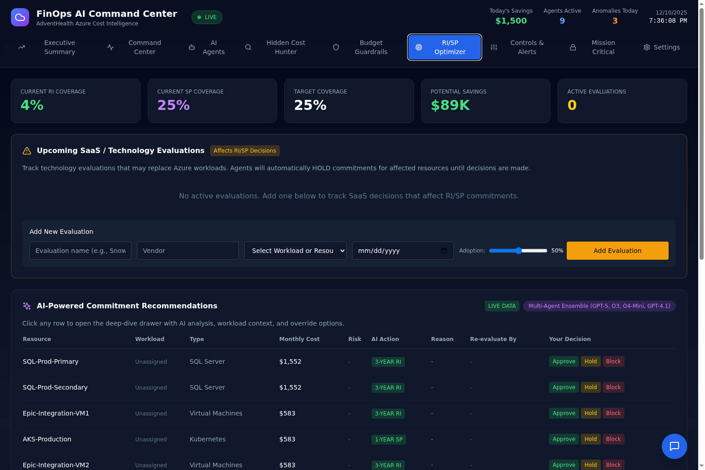
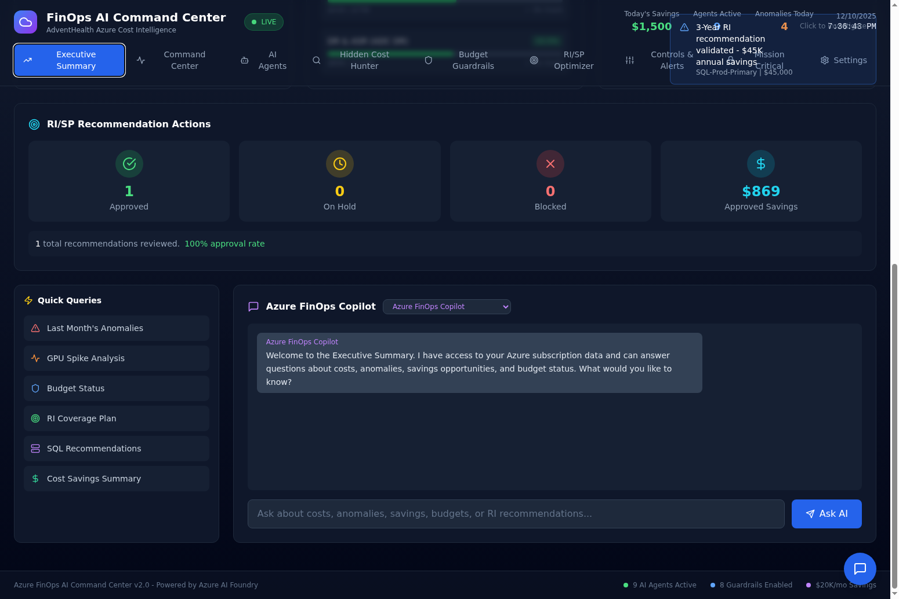
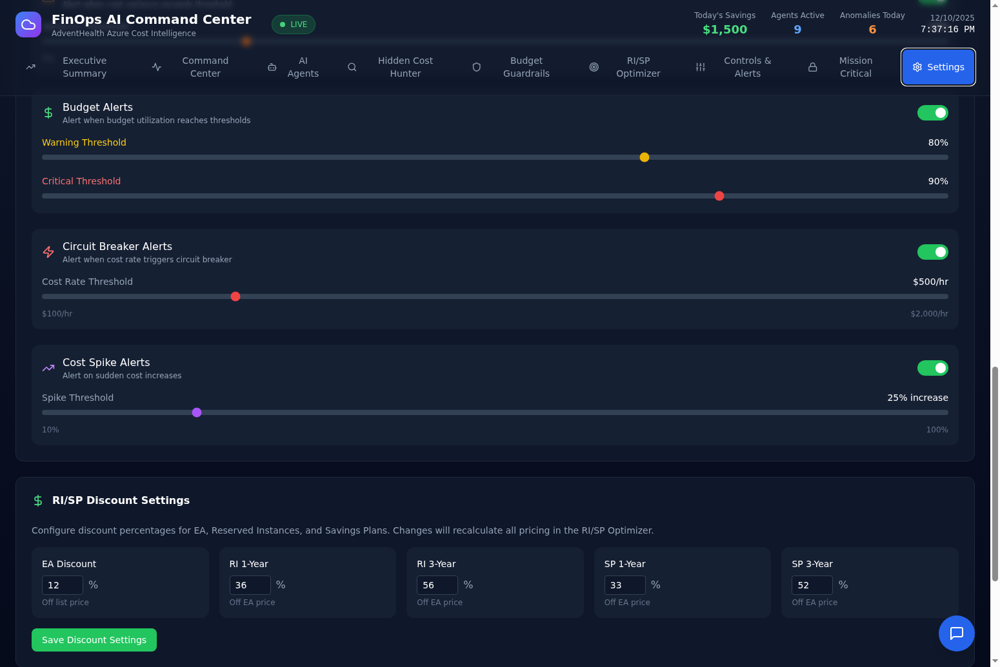

# FinOps AI Command Center

An AI-powered Azure FinOps dashboard that automates cost optimization, RI/SP commitment decisions, and anomaly detection using a multi-agent ensemble (GPT-5, O3, O4-Mini, GPT-4.1).

## Why RI/SP Optimization Matters

Reserved Instances (RI) and Savings Plans (SP) can reduce Azure compute costs by 33-56%, but making the wrong commitment decision can lock you into unused capacity for 1-3 years. This dashboard solves that problem by:

1. **AI-Powered Risk Assessment** - Multi-agent ensemble analyzes workload stability, growth patterns, and technology evaluations before recommending commitments
2. **SaaS Evaluation Tracking** - Automatically HOLD commitments when you're evaluating Snowflake, Databricks, or other SaaS that might replace Azure workloads
3. **Human-in-the-Loop Governance** - Approve, Hold, or Block each recommendation with full audit trail
4. **Dynamic Pricing** - Configure your EA discount and see real-time RI/SP price calculations



## Quick Start (5 Minutes)

### Step 1: Clone and Install

```bash
git clone https://github.com/gregnatkatz/finops.git
cd finops

# Backend
cd finops-backend
poetry install
cp .env.example .env

# Frontend
cd ../finops-frontend
npm install
```

### Step 2: Configure Environment

Edit `finops-backend/.env`:

```env
# Required: Azure OpenAI for AI agents
AZURE_OPENAI_ENDPOINT=https://your-resource.openai.azure.com/
AZURE_OPENAI_API_KEY=your-api-key
AZURE_OPENAI_DEPLOYMENT=gpt-4

# Optional: Azure credentials for live data (see "Connect Azure" below)
AZURE_TENANT_ID=
AZURE_CLIENT_ID=
AZURE_CLIENT_SECRET=
AZURE_SUBSCRIPTION_ID=
```

### Step 3: Run

```bash
# Terminal 1: Backend
cd finops-backend
poetry run uvicorn app.main:app --reload --port 8000

# Terminal 2: Frontend
cd finops-frontend
npm run dev
```

Open http://localhost:5173 - the dashboard runs in demo mode with simulated data until you connect Azure.

## Connect Your Azure Tenant

### Create App Registration (5 minutes)

1. Go to **Azure Portal > Azure Active Directory > App registrations**
2. Click **New registration**, name it "FinOps Dashboard", click Register
3. Copy the **Application (client) ID** and **Directory (tenant) ID**
4. Go to **Certificates & secrets > New client secret**
5. Copy the **secret value immediately** (it won't show again)

### Assign Permissions (2 minutes)

1. Go to **your Subscription > Access control (IAM) > Add role assignment**
2. Add **Cost Management Reader** role to your App Registration
3. Add **Reader** role to your App Registration

### Connect in Dashboard

1. Open dashboard, go to **Settings** tab
2. Enter Tenant ID, Client ID, Client Secret, Subscription ID
3. Click **Connect to Azure**

The badge changes from "DEMO DATA" to "LIVE DATA" when connected.

### Conditional Access Blocked?

If your organization blocks service principals, you have two options:

**Option A: Request Exception**
- Contact your Azure AD admin with: App name "FinOps Dashboard", Client ID, justification "Automated FinOps governance"
- Request exclusion from MFA policies (service principals use client credentials, not user auth)

**Option B: Use Offline Import**
- Export recommendations from Azure Portal > Advisor > Download as CSV
- Paste into Settings > Manual Data Import
- AI agents still analyze and provide recommendations

## RI/SP Decision Workflow

### 1. Review AI Recommendations

The RI/SP Optimizer shows AI-powered commitment recommendations with:

| Column | Description |
|--------|-------------|
| Resource | Azure resource name |
| Workload | Matched business application (if registered) |
| Type | VM, SQL, Kubernetes, GPU, etc. |
| Monthly Cost | Current pay-as-you-go cost |
| Risk | AI risk score (0-10) based on workload stability |
| AI Action | Recommended commitment: 1-Year RI, 3-Year RI, 1-Year SP, 3-Year SP, or HOLD |
| Reason | AI explanation for the recommendation |
| Re-evaluate By | Date to revisit if on HOLD |
| Your Decision | Approve, Hold, or Block buttons |

### 2. Track Your Decisions

Click **Approve**, **Hold**, or **Block** on each recommendation. Your decisions are tracked in the Executive Summary:



The RI/SP Recommendation Actions card shows:
- Total approved, on hold, and blocked counts
- Approved savings (sum of monthly savings from approved recommendations)
- Approval rate percentage

### 3. Configure Discount Rates

Go to **Settings > RI/SP Discount Settings** to configure your organization's discount percentages:



| Setting | Default | Description |
|---------|---------|-------------|
| EA Discount | 12% | Your Enterprise Agreement discount off list price |
| RI 1-Year | 36% | Reserved Instance 1-year discount off EA price |
| RI 3-Year | 56% | Reserved Instance 3-year discount off EA price |
| SP 1-Year | 33% | Savings Plan 1-year discount off EA price |
| SP 3-Year | 52% | Savings Plan 3-year discount off EA price |

Click **Save Discount Settings** to persist. All pricing in the RI/SP Optimizer recalculates automatically.

### 4. Track SaaS Evaluations

Before committing to a 3-year RI on SQL Server, make sure you're not about to migrate to Snowflake. The **Upcoming SaaS / Technology Evaluations** section lets you:

1. Add evaluations with vendor name, affected workload, decision date, and adoption probability
2. AI agents automatically HOLD commitments for affected resources
3. When the evaluation completes, remove it and the HOLD is lifted

## AI Agents

The dashboard uses 5 specialized AI agents powered by Azure OpenAI:

| Agent | Model | Purpose |
|-------|-------|---------|
| Cost Sentinel | GPT-5 | Anomaly detection and cost spike analysis |
| Commitment Advisor | O3 | RI/SP recommendation optimization |
| Orphan Hunter | O4-Mini | Identify unused resources |
| Right-Size Engine | GPT-4.1 | VM right-sizing recommendations |
| SaaS Evaluator | GPT-5 | Technology evaluation risk assessment |

Each agent provides:
- Risk score (0-10)
- Confidence level
- Recommended action with reasoning
- Re-evaluation date for HOLD decisions

## API Reference

### Core Endpoints

| Endpoint | Method | Description |
|----------|--------|-------------|
| `/api/recommendations` | GET | RI/SP recommendations with AI analysis |
| `/api/recommendations/smart` | GET | Recommendations enriched with workload intelligence |
| `/api/risp-actions` | GET | Summary of approve/hold/block actions |
| `/api/risp-actions/{action}` | POST | Record an approve/hold/block decision |
| `/api/discount-settings` | GET/PUT | Get or update discount percentages |

### Azure Integration

| Endpoint | Method | Description |
|----------|--------|-------------|
| `/api/azure/health` | GET | Connection status |
| `/api/azure/costs/daily` | GET | Daily cost breakdown |
| `/api/azure/costs/by-service` | GET | Cost by Azure service |
| `/api/azure/recommendations` | GET | Azure Advisor recommendations |
| `/api/azure/budgets` | GET | Budget status from Azure |

### Workload Intelligence

| Endpoint | Method | Description |
|----------|--------|-------------|
| `/api/workloads` | GET/POST | List or create workloads |
| `/api/evaluations` | GET/POST | List or create technology evaluations |
| `/api/evaluations/{id}/analyze` | POST | Run SaaS evaluator AI agent |

## Architecture

```
finops-dashboard/
├── finops-backend/          # FastAPI + SQLite
│   ├── app/
│   │   ├── main.py          # API routes
│   │   ├── agents/          # AI agent implementations
│   │   ├── services/        # Business logic
│   │   └── models/          # SQLAlchemy models
│   └── pyproject.toml
├── finops-frontend/         # React + TypeScript
│   ├── src/
│   │   └── App.tsx          # Main dashboard component
│   └── package.json
└── screenshots/             # Documentation images
```

### Technology Stack

- **Frontend**: React 18, TypeScript, Tailwind CSS, Recharts
- **Backend**: FastAPI, SQLite, SQLAlchemy, APScheduler
- **AI**: Azure OpenAI (GPT-5, O3, O4-Mini, GPT-4.1)
- **Azure SDKs**: azure-mgmt-costmanagement, azure-mgmt-advisor, azure-mgmt-consumption

## Deployment

### Backend (Fly.io)

```bash
cd finops-backend
fly launch
fly secrets set AZURE_OPENAI_ENDPOINT=... AZURE_OPENAI_API_KEY=...
fly deploy
```

### Frontend (Static Hosting)

```bash
cd finops-frontend
npm run build
# Deploy dist/ folder to Vercel, Netlify, or any static host
```

## Demo Videos

### RI/SP Decision Workflow Demo

Watch the narrated demo showcasing the RI/SP decision workflow with Approve/Hold/Block buttons and configurable discount settings:

[](https://github.com/gregnatkatz/finops/raw/devin/1765376384-phase1-azure-integration/video_assets/finops_risp_demo.mp4)

**[Download RI/SP Demo Video (4.2 MB)](https://github.com/gregnatkatz/finops/raw/devin/1765376384-phase1-azure-integration/video_assets/finops_risp_demo.mp4)**

### Full Dashboard Demo

Watch the complete dashboard walkthrough:

[](https://github.com/gregnatkatz/finops/raw/mainbr/video_assets/finops_demo.mp4)

**[Download Full Demo Video (6.8 MB)](https://github.com/gregnatkatz/finops/raw/mainbr/video_assets/finops_demo.mp4)**

## License

MIT License
